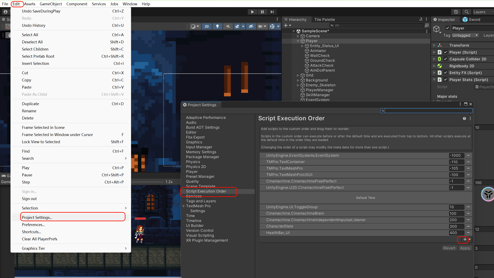

# 一、代码解析

## 1.状态机代码

`player.cc`

```C#
using System.Collections;
using System.Collections.Generic;
using UnityEngine;

public class Player : MonoBehaviour
{


    #region State
    public PlayerStateMachine stateMachine { get; private set; }

    #endregion

    protected override void Awake()
    {
        base.Awake();
        stateMachine = new PlayerStateMachine();
    }

    protected override void Start()
    {

        base.Start();
        stateMachine.Initialize(idleState);
    }

    protected override void Update()
    {
        base.Update();
        stateMachine.currenState.Update();
    }
    
	public void AnimationTrigger() => stateMachine.currenState.AnimationFinishTrigger();
  
}

```

`playerState`

```C#
using System.Collections;
using System.Collections.Generic;
using UnityEngine;


public class PlayerState
{
    protected PlayerStateMachine stateMachine;
    protected Player player;

    protected Rigidbody2D rb;
    private string animBoolName;

    protected float stateTimer;
    protected bool triggerCalled;

    public PlayerState(Player _player,  PlayerStateMachine _stateMachine, string _animBoolName)
    {
        this.player = _player;
        this.stateMachine = _stateMachine;
        this.animBoolName = _animBoolName;

    }

    public virtual void Enter()
    {
        rb = player.rb;
        player.anim.SetBool(animBoolName, true);
        triggerCalled = false;
    }

    public virtual void Update()
    {
        stateTimer -= Time.deltaTime;
    }
    public virtual void Exit() 
    {
        player.anim.SetBool(animBoolName, false);
    }

    public virtual void AnimationFinishTrigger() 
    { 
        triggerCalled = true;
    }
}

```

`playerStateMachine`

```C#
using System.Collections;
using System.Collections.Generic;
using UnityEngine;

public class PlayerStateMachine
{
    public PlayerState currenState {  get; private set; }

    public void Initialize(PlayerState _startState)
    {
        currenState = _startState;
        currenState.Enter();
    }

    public void ChangeState(PlayerState _newState)
    {
        currenState.Exit();
        currenState = _newState;
        currenState.Enter();
    }
}

```

## 2.无限背景代码

`public class ParallaxBackgrou`

```C#
using System.Collections;
using System.Collections.Generic;
using System.Xml.Linq;
using UnityEngine;

public class ParallaxBackground : MonoBehaviour
{
    private GameObject cam;
    [SerializeField] private float parallaxEffect;

    private float xPosition;
    private float length;
    
    void Start()
    {
        cam = GameObject.Find("Main Camera");
        xPosition = transform.position.x;//当前对象中心处在的位置
        length = GetComponent<SpriteRenderer>().bounds.size.x;//获取当前对象图片的长
    }

    
    void Update()
    {
        //实现场景随着摄像头进行的移动
        float distanceToMove = cam.transform.position.x * parallaxEffect;
        transform.position = new Vector3(xPosition + distanceToMove, transform.position.y);

        //实现无限背景的
        //如果当前背景不在摄像头的范围里时，就将其向前移动一个图片实现重合
        float distanceMove = cam.transform.position.x * (1 - parallaxEffect);
        if (distanceMove > length + xPosition)
        {
            xPosition = xPosition + length;
        }
        else if(distanceMove < xPosition - length)
        {
            xPosition = xPosition - length;
        }
    }
}
```

## 3.攻击状态结束

`PlayerAnimationTriggers.cs`

```C#
using System.Collections;
using System.Collections.Generic;
using UnityEngine;

// PlayerAnimationTriggers类继承自Unity的MonoBehaviour，用于处理玩家动画的触发。
public class PlayerAnimationTriggers : MonoBehaviour
{
    // 使用Expression-bodied成员来获取父对象中的Player组件。
    // 这是一个简洁的写法，相当于一个属性，用于获取Player组件的引用。
    private Player player => GetComponentInParent<Player>();

    // AnimationTrigger方法在特定的动画事件触发时被调用。
    // 这个方法调用Player组件的AnimationTrigger方法，用于同步动画和游戏逻辑。
    private void AnimationTrigger()
    {
        // 调用Player对象的AnimationTrigger方法，传递动画触发信号。
        player.AnimationTrigger();
    }
    //在动画的需要的帧上添加时间然后调用这个方法
}
```

`Player.cs`

```C#
public void AnimationTrigger() => stateMachine.currenState.AnimationFinishTrigger();
```

`PlayerState.cs`

```C#
public virtual void AnimationFinishTrigger() 
{ 
    triggerCalled = true;

}
```


# 二、碰到的问题

- 1.在使用Debug.Log(Input.GetAxis("Horizontal"));时，只要点击其他地方，按ad就没有用了

要在动画窗重新点击物体

- 2.一些操作

shift+home:选中当前代码行

alt-方向键上下:将选中的代码行上下移动

alt+space:快速重构当前选中的代码为一个函数

ctrl+r+r:重命名当前选中变量，并且修改相同变量的名字

- 3.动画controller首先要找到载体,然后再去加动画,其次,必须选择Animator才能看动画(万一我不知道animator是属于谁的呢)

应该是你先去找animator这个对象,然后去找他的动画(可以直接在里面进行切换),而不是先去找动画再去找对象,主客颠倒了.

- 4.重心重合主要是靠移动animator到与中心重合,然后使用pivot来确定位置.

- 5.如果图层不一样,角色起始的位置如果和其他图层重叠了,是无法移动的

- 6.图像的transform不要随便改,可能会发生一些想不到的bug

- 7.Header无法起作用

Header的下一行是一个private的值,所以不会起作用,后面要是SerializeField/public

- 8.在帧增加事件后会有个小白线,要注意看

- 9.Awake和Start的区别

Awake:

Awake 是一个在游戏对象被实例化时首先调用的方法。它在对象被加载到场景中但在启用之前调用。
**适合在这个阶段进行初始化工作，如查找其他组件、获取引用、设置初始数值等。**
由于在对象加载时调用，即使对象处于非活动状态（SetActive(false)），Awake 方法也会被执行。
就是说即使物体被禁用，Awake 方法也会被调用
Start:

Start 方法在 Awake 方法之后被调用，用于在游戏对象启用后执行一次性初始化操作。
**适合在这个阶段进行需要在对象启用后进行的初始化，比如启动协程、开始动画、订阅事件等。**
Start 方法只在对象处于激活状态时被调用。如果对象被禁用（SetActive(false)），Start 方法不会执行。

- [10.C#的延迟机制](https://blog.csdn.net/qq_15020543/article/details/82701551)

StartCoroutine(Example());（注意方法名后加括号，参数可写在括号里）
优点：灵活，性能开销小。

缺点：无法单独的停止这个协程，如果需要停止这个协程只能等待协同程序运行完毕或则使用StopAllCoroutine();方法。

2、StartCoroutine (methodName:string, value : object = null);

StartCoroutine("string methodName",value);(注意双引号，value为想传递的参数)
优点：可以直接通过传入协同程序的方法名来停止这个协程：StopCoroutine("string methodName");(注意双引号)
缺点：性能的开销较大，只能传递一个参数。

- 11.表达式-bodied成员（也称为“fat arrow”语法）

- 12.NullReferenceException: Object reference not set to an instance of an object报错

出现这个错误之后，一定要仔细检查自己代码里面的任何一个可能空的值。一定是这个原因

报空的地方比如：代码中你写到了但是你Unity中没有，或者你Unity中挂载错了；在代码中写了一些值但是却没有给他们赋值，导致报空；在代码中规定了Button的作用，但是却忘记在Unity中绑定Button；代码中的命名与Unity中的命名不统一；等等一系列问题都会导致报空.

**注意如果把例如容器之类的设置为私有，则不会由unity进行创建，要自己new一个，否则也会报这个错误**

- 13.报错**UnityEditor.Graphs.Edge.WakeUp ()**

这个是Unity3D自身存在的BUG，代码位于UnityEditor.Graphs.DLL中。

这个BUG需要操作什么，只需要尝试关闭和重新打开Unity项目即可。

这个问题似乎在删除和重新创建没有任何变换Transform的动画控制器Animator的时候，很常出现这种情况。

- 14如何让动画图像变清晰

把图像的Compress变为None，Filter Mode变为Point

- 15 'xxx' AnimationEvent has no function name specified!

在动画中设置了事件但是没有指定函数

- 16.想要设置script的执行先后顺序



- 17在空中设置rb.velocity为0，还会往下掉

**物理引擎**：Unity的物理引擎是基于时间步长的，即使你将 `velocity` 设置为 `0`，如果物理引擎在下一个时间步长中检测到重力或其他力的影响，物体仍然会继续下落。

- 18 遇到.meta存在但是文件不存在

只在unity里面去改名，不要在文件夹里面改。meta文件的名字必须和资源名字匹配

- 19 在执行保存和加载技能树时,虽然成功加载,但是技能不能使用

修改SaveManager的执行顺序到最前面,才能确保在执行CheckUnlock函数时数据全部加载进来了.

- 20 到底unity的执行顺序是什么

考虑start和Awake、考虑函数执行顺序两者的影响

saveManager应该在所有实现了ISaveManager接口函数的后面执行，不然函数的start都没开始就执行了加载接口
